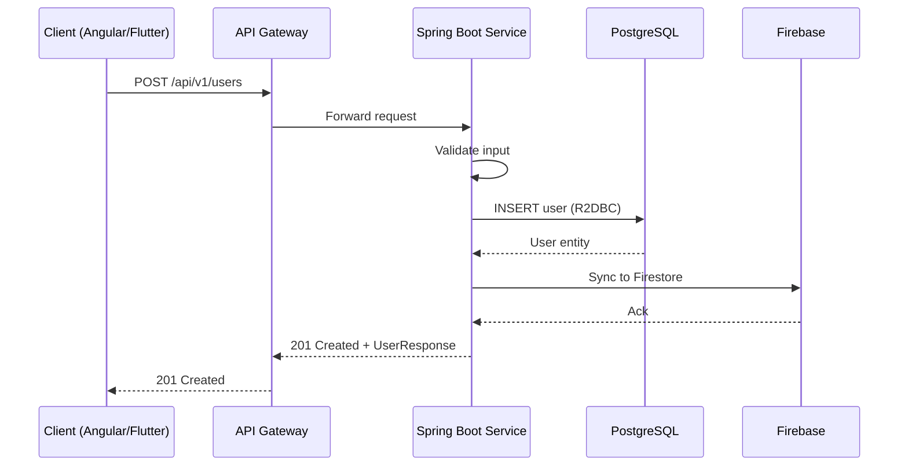
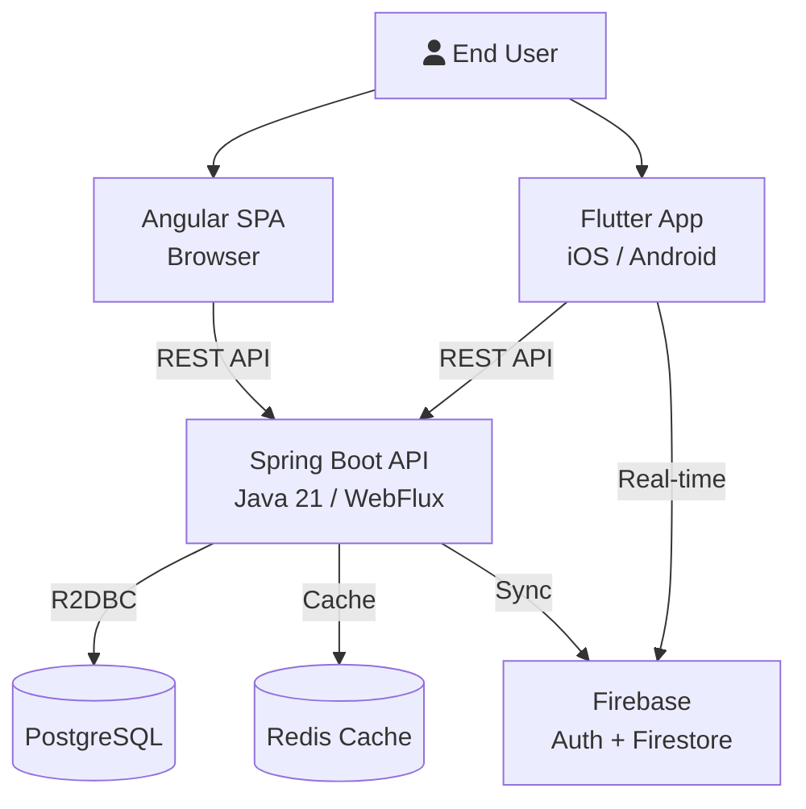

# Architecture Design Templates

## Sequence Diagram Template (Mermaid)



## C4 System Context Diagram (Mermaid)



## API Contract Starter (OpenAPI snippet)

```yaml
openapi: 3.0.3
info:
  title: My Service API
  version: 1.0.0
paths:
  /api/v1/users:
    get:
      summary: List all users
      parameters:
        - name: page
          in: query
          schema: { type: integer, default: 0 }
        - name: size
          in: query
          schema: { type: integer, default: 20 }
      responses:
        '200':
          description: Paginated list of users
          content:
            application/json:
              schema:
                type: object
                properties:
                  data:
                    type: array
                    items: { $ref: '#/components/schemas/User' }
                  pagination:
                    $ref: '#/components/schemas/Pagination'
    post:
      summary: Create a user
      requestBody:
        required: true
        content:
          application/json:
            schema: { $ref: '#/components/schemas/CreateUserRequest' }
      responses:
        '201':
          description: User created
```

For comprehensive OpenAPI spec generation, use the `openapi-spec-generation` skill.

## Docker Compose -- Dev Environment

```yaml
version: '3.9'
services:
  postgres:
    image: postgres:16-alpine
    environment:
      POSTGRES_DB: mydb
      POSTGRES_USER: postgres
      POSTGRES_PASSWORD: postgres
    ports: ['5432:5432']
    volumes: ['pgdata:/var/lib/postgresql/data']

  redis:
    image: redis:7-alpine
    ports: ['6379:6379']

  backend:
    build: ./backend
    ports: ['8080:8080']
    environment:
      SPRING_R2DBC_URL: r2dbc:postgresql://postgres:5432/mydb
      SPRING_FLYWAY_URL: jdbc:postgresql://postgres:5432/mydb
      FLYWAY_ENABLED: "true"
    depends_on: [postgres, redis]

volumes:
  pgdata:
```

## ADR Quick Template

```markdown
# ADR-001: <Title>

**Status:** Proposed | Accepted | Deprecated | Superseded
**Date:** YYYY-MM-DD
**Decision Makers:** <names>

## Context
What is the issue we are facing?

## Decision
What is the change we are proposing?

## Consequences
### Positive
- ...
### Negative
- ...
### Risks
- ...
```

For detailed ADR workflows (lifecycle, examples, review process), use the `architecture-decision-records` skill.
