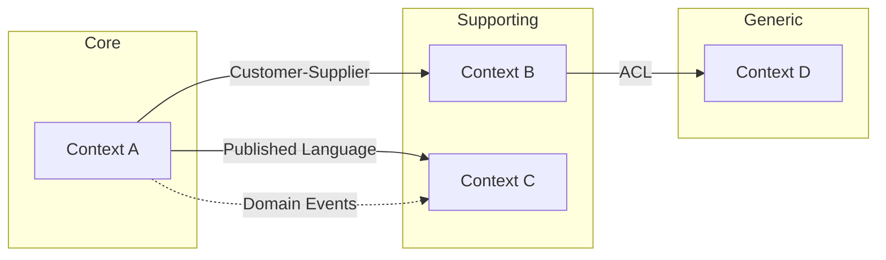

# Strategic Design Reference

## Subdomain Classification

### Core Subdomains
- Competitive advantage — what makes this business unique
- Highest investment priority, most skilled developers
- Custom-built, never off-the-shelf
- **Test:** If you remove this, does the business lose its differentiator?

### Supporting Subdomains
- Necessary for the business but not differentiating
- Moderate complexity, can be built by less specialized teams
- Could potentially be outsourced
- **Test:** Important but another company in a different industry might solve it the same way

### Generic Subdomains
- Commodity problems solved by many businesses identically
- Buy or adopt existing solutions (auth, payments, email, notifications)
- Lowest strategic value — don't reinvent
- **Test:** Could you replace this with a SaaS product?

### Strategic Classification Matrix

```
                    High Complexity
                         │
    Supporting            │           Core
    (Build in-house,      │     (Build in-house,
     moderate invest)     │      highest invest)
                          │
  ──────────────────────────────────────────
                          │
    Generic               │       Supporting
    (Buy/adopt,           │     (Build or buy,
     minimal invest)      │      case-by-case)
                          │
                    Low Complexity
  Low Strategic Value ─────────── High Strategic Value
```

## Bounded Context Discovery

### Linguistic Analysis Method

1. **Collect domain terms** from requirements, user stories, conversations
2. **Identify terms that mean different things** to different stakeholders
   - "Account" to billing vs. "Account" to user management
   - "Order" to fulfillment vs. "Order" to payments
3. **Group terms that always appear together** — these likely belong in the same context
4. **Draw boundaries** where the same word changes meaning

### Business Capability Method

1. List all business capabilities (what the business does, not how)
2. Group capabilities that share the same data and rules
3. Each group is a candidate bounded context
4. Validate: does each context have a clear single responsibility?

### Heuristics for Context Boundaries

- Different lifecycle → different context
- Different rate of change → different context
- Different stakeholders/teams → different context
- Different consistency requirements → different context
- Same ubiquitous language → same context

## Ubiquitous Language

For each bounded context, define:

```markdown
## Context: [Name]

### Terms
| Term | Definition | NOT to be confused with |
|------|-----------|------------------------|
| [Term] | [Precise definition within this context] | [Same word in other context] |

### Rules
- [Business rule expressed in domain language]

### Examples
- "[Domain sentence using terms correctly]"
```

## Context Mapping Patterns

### Relationship Types

| Pattern | Description | When to Use |
|---------|-------------|-------------|
| **Partnership** | Two contexts evolve together, mutual dependency | Teams collaborate closely, shared roadmap |
| **Shared Kernel** | Small shared model both contexts depend on | Stable shared concepts (e.g., Money, Address) |
| **Customer-Supplier** | Upstream provides what downstream needs | Clear producer-consumer relationship |
| **Conformist** | Downstream adopts upstream's model as-is | Upstream won't change, low integration cost |
| **Anti-Corruption Layer** | Downstream translates upstream's model | Upstream model is messy or legacy |
| **Open Host Service** | Upstream publishes a clean API/protocol | Multiple consumers of the same service |
| **Published Language** | Shared interchange format (events, schemas) | Cross-context integration via events |
| **Separate Ways** | No integration — contexts are independent | No meaningful data flow between contexts |

### Context Map Diagram Template (Mermaid)



### Integration Decisions

For each relationship, document:

1. **Direction**: Who depends on whom?
2. **Pattern**: Which context mapping pattern?
3. **Mechanism**: Sync (API call) or Async (events)?
4. **Data**: What crosses the boundary?
5. **Translation**: How is the foreign model adapted?
6. **Failure mode**: What happens when the other context is down?

## Team Topology Alignment (Conway's Law)

Map bounded contexts to team ownership:

```markdown
| Bounded Context | Owner Team | Interaction Mode |
|----------------|-----------|-----------------|
| [Context] | [Team] | [Collaboration / X-as-a-Service / Facilitating] |
```

- **Collaboration**: Teams work together closely (use for core subdomains early on)
- **X-as-a-Service**: Team provides API, consumers self-serve (use for mature/generic contexts)
- **Facilitating**: One team helps another build capability (use for knowledge transfer)
