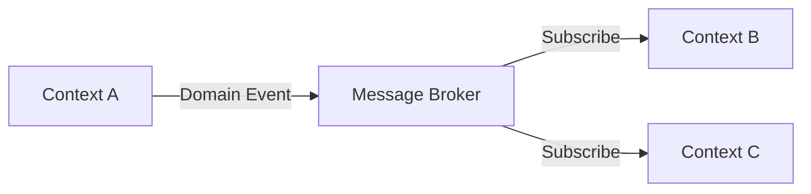

# Technical Architecture Reference

## API Design

### Resource Modeling (Aligned with Aggregates)

- Each aggregate root maps to a REST resource
- Nested entities accessed through aggregate root (not independently)
- Value objects are embedded, not separate endpoints

```
Good:  POST /orders/{orderId}/line-items     (line item is part of Order aggregate)
Bad:   POST /line-items                       (exposes internal entity independently)
```

### HTTP Conventions

| Operation | Verb | Status Codes |
|-----------|------|-------------|
| Create | POST | 201 Created, 400 Bad Request, 409 Conflict |
| Read one | GET | 200 OK, 404 Not Found |
| Read list | GET | 200 OK (with pagination) |
| Full update | PUT | 200 OK, 404, 400 |
| Partial update | PATCH | 200 OK, 404, 400 |
| Delete | DELETE | 204 No Content, 404 |
| Command (action) | POST | 200/202, 400, 409 |

### API Versioning

- **URL versioning** (`/api/v1/`) — simplest, most visible
- **Header versioning** (`Accept: application/vnd.api.v1+json`) — cleaner URLs
- **Pick one and be consistent across all contexts**

### Error Response Format (Standardize Across All Contexts)

```json
{
  "error": {
    "code": "ORDER_LIMIT_EXCEEDED",
    "message": "Human-readable description",
    "details": [
      { "field": "quantity", "reason": "Must be <= 100" }
    ],
    "traceId": "abc-123"
  }
}
```

## Database Architecture

### Schema Per Bounded Context

Each bounded context owns its data. No shared tables between contexts.

```
Context A database/schema:
  └── tables owned exclusively by Context A

Context B database/schema:
  └── tables owned exclusively by Context B

  NEVER: Context B reads Context A's tables directly
  INSTEAD: Context B consumes Context A's events or calls its API
```

### Aggregate Persistence Patterns

| Pattern | When | Trade-off |
|---------|------|-----------|
| **Single table** | Simple aggregate, few fields | Easy but limited |
| **Table per entity** | Aggregate with distinct entities | Normal relational mapping |
| **JSON column** | Value objects, flexible nested data | Query flexibility vs. schema enforcement |
| **Event sourcing** | Audit trail needed, complex state transitions | Full history but complexity |

### Data Consistency Strategy

| Scope | Strategy | Mechanism |
|-------|----------|-----------|
| Within aggregate | Strong consistency | Single DB transaction |
| Between aggregates (same context) | Eventual consistency | Domain events + outbox pattern |
| Between bounded contexts | Eventual consistency | Async events via message broker |

### Outbox Pattern (Reliable Event Publishing)

```
1. Save aggregate state change + event to outbox table in SAME transaction
2. Background process polls outbox table
3. Publishes event to message broker
4. Marks outbox entry as published
```

This guarantees: state change and event are atomic — no lost events, no phantom events.

### Migration Strategy

- One migration stream per bounded context
- Migrations are forward-only (no rollbacks in production)
- Breaking changes: expand-contract pattern (add new → migrate data → remove old)
- Schema changes must not break running instances (zero-downtime deployments)

## Integration Patterns

### Event-Driven Architecture



### Anti-Corruption Layer (ACL)

When integrating with external or legacy systems:

```
Your Context ←→ [ACL: Translator] ←→ External System

ACL responsibilities:
  - Translates external model → your domain model
  - Isolates your context from external changes
  - Handles external API quirks and failures
```

### Integration Decision Matrix

| Factor | Synchronous (API) | Asynchronous (Events) |
|--------|-------------------|----------------------|
| Needs immediate response | ✅ | ❌ |
| Tolerance for delay | ❌ | ✅ |
| Coupling | Tight (temporal + behavioral) | Loose |
| Failure handling | Circuit breaker, retry | Dead letter queue, retry |
| Scalability | Limited by slowest service | Independent scaling |
| Debugging | Easier (request/response) | Harder (trace correlation) |

**Default to async events between bounded contexts.** Use sync only when the caller absolutely needs an immediate answer.

### Resilience Patterns

| Pattern | Purpose |
|---------|---------|
| **Circuit breaker** | Stop calling a failing service, fail fast |
| **Retry with backoff** | Handle transient failures |
| **Timeout** | Don't wait forever for a response |
| **Bulkhead** | Isolate failures, prevent cascading |
| **Dead letter queue** | Capture failed events for investigation |
| **Idempotency key** | Safe retries without duplicate effects |

## Cloud-Native Considerations

### Container Decomposition

- One bounded context = one deployable unit (container/service)
- For modular monolith: one module per context, single deployable
- Shared-nothing between containers (no shared filesystem, no shared DB)

### Observability

| Pillar | What | Standard |
|--------|------|----------|
| **Logs** | Structured, JSON, contextual | Correlation ID in every log line |
| **Metrics** | RED (Rate, Errors, Duration) per endpoint | Prometheus/OpenTelemetry format |
| **Traces** | Distributed traces across service calls | OpenTelemetry with trace propagation |

### Configuration Management

- Environment-specific config via environment variables
- Secrets via cloud secret manager (never in code, never in config files)
- Feature flags for progressive rollouts

### Scaling Patterns

| Context Type | Scaling Strategy |
|-------------|-----------------|
| Stateless API | Horizontal auto-scale on CPU/request count |
| Event consumer | Scale on queue depth/lag |
| Scheduled jobs | Single instance with leader election |
| Database | Read replicas for read-heavy, vertical for write-heavy |

## Architecture Diagrams (C4 Model)

Generate diagrams at four levels:

1. **System Context** — your system + external actors + external systems
2. **Container** — deployable units (services, databases, message brokers)
3. **Component** — modules within a container (for modular monolith)
4. **Code** — class/aggregate diagrams (only for complex aggregates)

Use Mermaid syntax for all diagrams.
